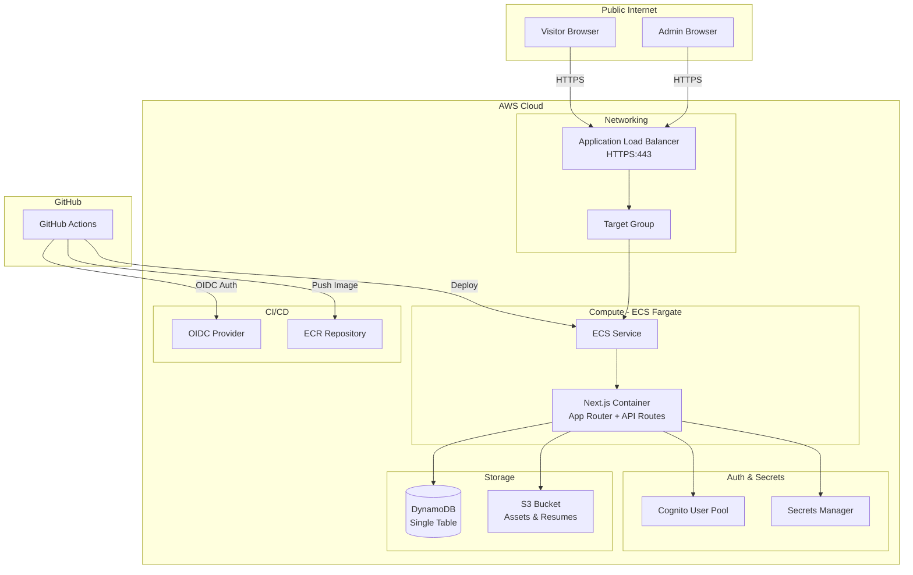
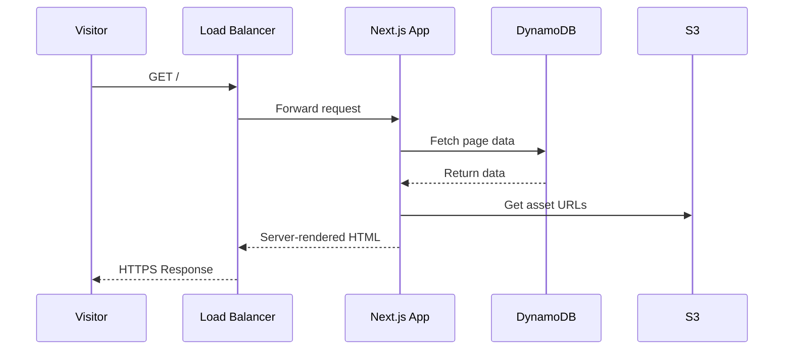
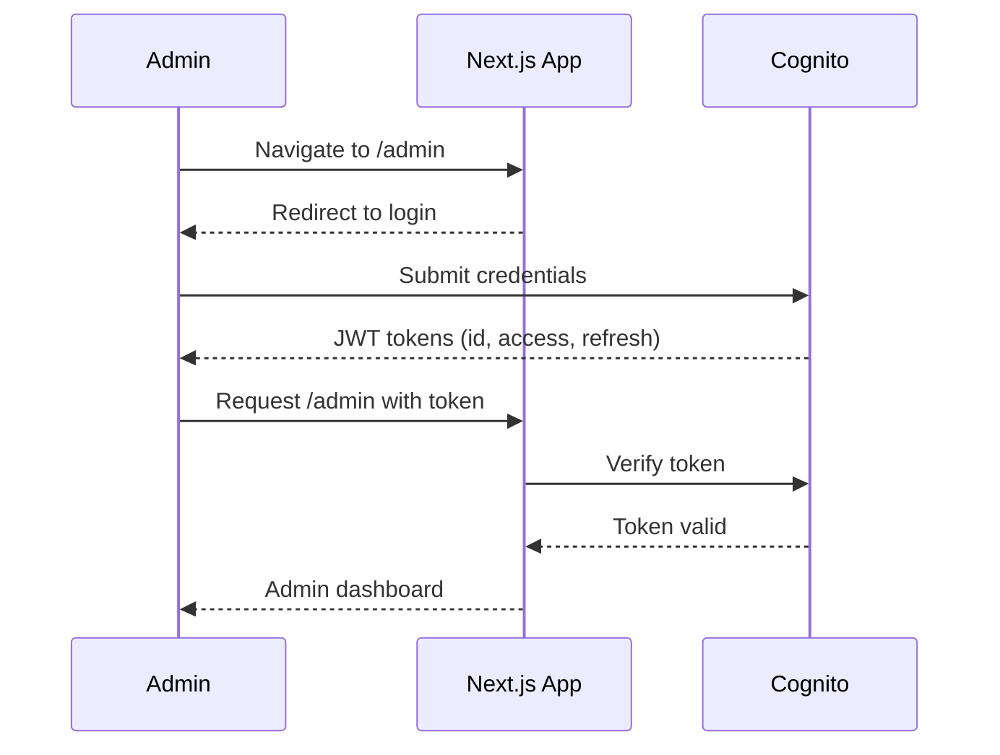

# Design Document

## Overview

This design describes the full-stack portfolio website rebuild using Next.js on AWS infrastructure. The application serves two audiences: public visitors browsing portfolio content, and the authenticated portfolio owner managing content through an admin panel.

The architecture follows a monolithic Next.js application deployed on ECS Fargate, using DynamoDB for data persistence, S3 for asset storage, and Cognito for authentication. All infrastructure is defined in Terraform with CI/CD via GitHub Actions using OIDC authentication.

### Key Design Decisions

1. **Single Next.js application**: Both public and admin interfaces live in one app, simplifying deployment while using route-based code splitting to keep public bundle sizes small.
2. **Server-side rendering for public pages**: Leverages Next.js App Router with server components for SEO and fast initial loads.
3. **DynamoDB single-table design**: Uses a single table with composite keys and GSIs for efficient access patterns, reducing operational overhead.
4. **S3 direct upload with presigned URLs**: Admin uploads go directly to S3 via presigned URLs, offloading file transfer from the application server.
5. **Terraform modular structure**: Infrastructure split into logical modules (networking, compute, storage, auth, CI/CD) for maintainability.

## Architecture

### High-Level System Architecture



### Request Flow



### Admin Authentication Flow



## Components and Interfaces

### Frontend Components

#### Public Layout Structure

```
app/
├── layout.tsx                  # Root layout (theme provider, fonts)
├── page.tsx                    # Home page (About, Projects, Experience, Skills, Contact)
├── resume/
│   └── page.tsx               # Web resume page
├── components/
│   ├── layout/
│   │   ├── Header.tsx         # Fixed header with nav, theme toggle
│   │   ├── Footer.tsx         # Footer with social links, copyright
│   │   └── MobileMenu.tsx     # Hamburger menu for mobile
│   ├── sections/
│   │   ├── About.tsx          # About section with resume download
│   │   ├── Projects.tsx       # Project grid
│   │   ├── ProjectDetail.tsx  # Project modal/expanded view
│   │   ├── Experience.tsx     # Experience timeline
│   │   ├── Skills.tsx         # Skills grouped by category
│   │   └── Contact.tsx        # Contact form
│   ├── ui/
│   │   ├── Button.tsx         # Reusable button component
│   │   ├── Card.tsx           # Card component for projects
│   │   ├── Input.tsx          # Form input with validation
│   │   ├── ThemeToggle.tsx    # Dark/light theme switch
│   │   └── ImageGallery.tsx   # Horizontal scrollable gallery
│   └── shared/
│       ├── SEOHead.tsx        # Meta tags component
│       ├── Placeholder.tsx    # Empty state placeholder
│       └── ScrollAnimation.tsx # Scroll-triggered animation wrapper
├── admin/
│   ├── layout.tsx             # Admin layout with auth guard
│   ├── page.tsx               # Admin dashboard
│   ├── projects/
│   │   ├── page.tsx           # Project list management
│   │   └── [id]/page.tsx      # Project edit form
│   ├── experience/
│   │   └── page.tsx           # Experience management
│   ├── skills/
│   │   └── page.tsx           # Skills management
│   ├── about/
│   │   └── page.tsx           # About content editor
│   ├── resumes/
│   │   └── page.tsx           # Resume management
│   └── messages/
│       └── page.tsx           # Message inbox
└── api/
    ├── projects/
    │   └── route.ts           # CRUD for projects
    ├── experience/
    │   └── route.ts           # CRUD for experience
    ├── skills/
    │   └── route.ts           # CRUD for skills
    ├── about/
    │   └── route.ts           # About content management
    ├── resumes/
    │   ├── route.ts           # Resume metadata CRUD
    │   └── upload/route.ts    # Presigned URL generation
    ├── messages/
    │   └── route.ts           # Message CRUD + create from contact form
    ├── contact/
    │   └── route.ts           # Public contact form submission
    └── auth/
        └── route.ts           # Auth helpers (token verification)
```

#### Admin Panel Structure

The admin panel uses a sidebar navigation layout with sections for each content type. All admin routes are protected by middleware that verifies Cognito JWT tokens.

### API Design

#### Public API Routes (No Auth Required)

| Method | Path | Description |
|--------|------|-------------|
| GET | `/api/projects` | List published projects |
| GET | `/api/projects/[id]` | Get single project details |
| GET | `/api/experience` | List experience entries |
| GET | `/api/skills` | List skills grouped by category |
| GET | `/api/about` | Get about content |
| GET | `/api/resumes/preferred` | Get preferred resume download URL |
| POST | `/api/contact` | Submit contact form message |

#### Admin API Routes (Auth Required)

| Method | Path | Description |
|--------|------|-------------|
| POST | `/api/projects` | Create project |
| PUT | `/api/projects/[id]` | Update project |
| DELETE | `/api/projects/[id]` | Delete project + assets |
| PUT | `/api/projects/[id]/reorder-images` | Reorder project images |
| POST | `/api/experience` | Create experience entry |
| PUT | `/api/experience/[id]` | Update experience entry |
| DELETE | `/api/experience/[id]` | Delete experience entry |
| POST | `/api/skills` | Create skill |
| PUT | `/api/skills/[id]` | Update skill |
| DELETE | `/api/skills/[id]` | Delete skill |
| PUT | `/api/about` | Update about content |
| GET | `/api/resumes` | List all resumes |
| POST | `/api/resumes/upload` | Get presigned upload URL |
| PUT | `/api/resumes/[id]/preferred` | Set preferred resume |
| DELETE | `/api/resumes/[id]` | Delete resume |
| GET | `/api/messages` | List messages (paginated) |
| GET | `/api/messages/[id]` | Get single message (marks as read) |
| DELETE | `/api/messages/[id]` | Delete message |

#### API Request/Response Examples

**POST /api/contact**
```json
// Request
{
  "name": "Jane Smith",
  "email": "jane@example.com",
  "message": "I'd like to discuss a potential role..."
}

// Response 201
{
  "success": true,
  "message": "Message sent successfully"
}

// Response 400
{
  "success": false,
  "errors": {
    "email": "Invalid email format",
    "message": "Message is required"
  }
}
```

**POST /api/resumes/upload**
```json
// Request
{
  "filename": "resume-2024.pdf",
  "contentType": "application/pdf",
  "fileSize": 245000
}

// Response 200
{
  "uploadUrl": "https://s3.amazonaws.com/...",
  "resumeId": "res_abc123",
  "expiresIn": 3600
}

// Response 400
{
  "success": false,
  "error": "File must be PDF format and under 10MB"
}
```

### Middleware and Auth Guard

```typescript
// middleware.ts - Next.js middleware for admin route protection
// Checks for valid Cognito JWT in cookies/headers
// Redirects to /admin/login if token is missing or invalid
// Allows public routes to pass through without auth
```

### Theme System

The theme system uses CSS custom properties with a React context provider:

- Theme preference resolution order: localStorage → OS preference → light default
- CSS variables defined at `:root` level, toggled via `data-theme` attribute
- Transition on `background-color` and `color` properties for smooth switching (≤300ms)
- Theme toggle component in Header with visual state indicator

## Data Models

### DynamoDB Single-Table Design

The application uses a single DynamoDB table with composite primary key (PK, SK) and Global Secondary Indexes for alternate access patterns.

**Table: PortfolioTable**

| Attribute | Type | Description |
|-----------|------|-------------|
| PK | String | Partition key |
| SK | String | Sort key |
| GSI1PK | String | GSI 1 partition key |
| GSI1SK | String | GSI 1 sort key |
| type | String | Entity type discriminator |
| data | Map | Entity-specific attributes |
| createdAt | String | ISO 8601 timestamp |
| updatedAt | String | ISO 8601 timestamp |

#### Entity Key Patterns

| Entity | PK | SK | GSI1PK | GSI1SK |
|--------|----|----|--------|--------|
| About | `ABOUT` | `CONTENT` | — | — |
| Project | `PROJECT#<id>` | `META` | `PROJECTS` | `ORDER#<displayOrder>` |
| Project Image | `PROJECT#<id>` | `IMAGE#<order>` | — | — |
| Experience | `EXP#<id>` | `META` | `EXPERIENCE` | `DATE#<startDate>` |
| Skill | `SKILL#<id>` | `META` | `SKILLS#<category>` | `NAME#<name>` |
| Skill Category | `SKILLCAT#<id>` | `META` | `SKILLCATS` | `ORDER#<displayOrder>` |
| Resume | `RESUME#<id>` | `META` | `RESUMES` | `DATE#<uploadDate>` |
| Message | `MSG#<id>` | `META` | `MESSAGES` | `DATE#<timestamp>` |
| Web Resume | `WEBRESUME` | `CONTENT` | — | — |

#### Entity Schemas

**Project**
```typescript
interface Project {
  id: string;              // UUID
  title: string;           // Required, max 200 chars
  description: string;     // Required, max 5000 chars
  githubUrl: string;       // Required, valid URL
  deploymentUrl?: string;  // Optional, valid URL
  published: boolean;      // Default false
  displayOrder: number;    // For ordering in grid
  images: ProjectImage[];  // 1-10 images
  createdAt: string;       // ISO 8601
  updatedAt: string;       // ISO 8601
}

interface ProjectImage {
  id: string;              // UUID
  s3Key: string;           // S3 object key
  url: string;             // Public URL
  order: number;           // Display order
  altText?: string;        // Accessibility alt text
}
```

**Experience**
```typescript
interface Experience {
  id: string;              // UUID
  jobTitle: string;        // Required, max 200 chars
  company: string;         // Required, max 200 chars
  startDate: string;       // YYYY-MM format
  endDate?: string;        // YYYY-MM format or null for current
  description: string;     // Required, max 5000 chars
  createdAt: string;       // ISO 8601
  updatedAt: string;       // ISO 8601
}
```

**Skill**
```typescript
interface Skill {
  id: string;              // UUID
  name: string;            // Required, max 100 chars
  categoryId: string;      // Reference to SkillCategory
  createdAt: string;       // ISO 8601
  updatedAt: string;       // ISO 8601
}

interface SkillCategory {
  id: string;              // UUID
  label: string;           // e.g., "Languages", "Frameworks"
  displayOrder: number;    // For ordering categories
  createdAt: string;       // ISO 8601
  updatedAt: string;       // ISO 8601
}
```

**About**
```typescript
interface About {
  personalDescription: string;  // Max 5000 chars
  professionalPitch: string;    // Max 5000 chars
  updatedAt: string;            // ISO 8601
}
```

**Resume**
```typescript
interface Resume {
  id: string;              // UUID
  filename: string;        // Original filename
  s3Key: string;           // S3 object key
  fileSize: number;        // Bytes
  isPreferred: boolean;    // Only one can be true
  uploadedAt: string;      // ISO 8601
}
```

**Message**
```typescript
interface Message {
  id: string;              // UUID
  name: string;            // Max 100 chars
  email: string;           // Max 254 chars, valid email
  body: string;            // Max 2000 chars
  isRead: boolean;         // Default false
  submittedAt: string;     // ISO 8601
}
```

**WebResume**
```typescript
interface WebResume {
  sections: WebResumeSection[];
  updatedAt: string;       // ISO 8601
}

interface WebResumeSection {
  id: string;              // UUID
  type: 'summary' | 'experience' | 'education' | 'skills' | 'certifications';
  title: string;           // Section heading
  content: string;         // Markdown or structured content
  order: number;           // Display order
}
```

### S3 Bucket Structure

```
portfolio-assets/
├── projects/
│   └── <project-id>/
│       └── <image-id>.<ext>
├── resumes/
│   └── <resume-id>.pdf
└── about/
    └── (reserved for future about section assets)
```

### Terraform Module Structure

```
terraform/
├── main.tf                 # Root module, provider config
├── variables.tf            # Input variables
├── outputs.tf              # Output values
├── backend.tf              # S3 remote state config
├── modules/
│   ├── networking/         # VPC, subnets, security groups, ALB
│   ├── compute/            # ECS cluster, task def, service, ECR
│   ├── storage/            # DynamoDB table, S3 bucket
│   ├── auth/               # Cognito user pool, client
│   ├── secrets/            # Secrets Manager resources
│   └── cicd/               # OIDC provider, IAM roles for GHA
└── environments/
    └── prod/
        ├── terraform.tfvars
        └── backend.tfvars
```


## Correctness Properties

*A property is a characteristic or behavior that should hold true across all valid executions of a system — essentially, a formal statement about what the system should do. Properties serve as the bridge between human-readable specifications and machine-verifiable correctness guarantees.*

### Property 1: Resume File Validation

*For any* file metadata (type and size), the resume upload validation function SHALL accept only files with content type `application/pdf` and size ≤ 10MB, and reject all others with an appropriate error indicating which constraint was violated.

**Validates: Requirements 3.1, 3.7**

### Property 2: Preferred Resume Invariant

*For any* set of resumes and any "set preferred" operation targeting a specific resume, the resulting state SHALL have exactly one resume marked as preferred, and it SHALL be the one that was targeted.

**Validates: Requirements 3.3**

### Property 3: Admin-Defined Display Ordering

*For any* ordered collection (projects, web resume sections, skill categories) with admin-defined display order values, the public-facing output SHALL present items sorted by their display order in ascending order.

**Validates: Requirements 4.2, 5.4, 7.2**

### Property 4: Published Project Filtering

*For any* set of projects with mixed published/unpublished status, the public projects listing SHALL include only projects where `published` is true, and SHALL exclude all unpublished projects.

**Validates: Requirements 5.1**

### Property 5: Experience Reverse Chronological Ordering

*For any* set of experience entries with start dates, the public experience listing SHALL present entries sorted by start date in descending (most recent first) order.

**Validates: Requirements 6.1**

### Property 6: Experience Entry Rendering

*For any* experience entry, the rendered output SHALL contain the job title, company name, and start date. If the end date is null, the output SHALL display "Present" in place of the end date.

**Validates: Requirements 6.2, 6.5**

### Property 7: Skills Grouping and Empty Category Filtering

*For any* set of skills with category assignments, the public skills output SHALL group skills by their assigned category AND SHALL exclude any category that contains zero skills.

**Validates: Requirements 7.1, 7.4**

### Property 8: Contact Form Validation

*For any* contact form submission, the validation function SHALL reject submissions where name is empty, email does not match a valid email format, or message body is empty, and SHALL return field-specific error identifiers for each violated constraint.

**Validates: Requirements 8.3**

### Property 9: Message Persistence Integrity

*For any* valid contact message (name, email, body), after successful save the stored record SHALL contain the original name, email, body unchanged, and a submission timestamp that is a valid ISO 8601 datetime.

**Validates: Requirements 8.4**

### Property 10: Admin Route Protection

*For any* request to an admin panel route that lacks a valid authentication token, the application SHALL respond with a redirect to the login page and SHALL NOT return protected content.

**Validates: Requirements 9.5, 14.5**

### Property 11: Project Form Validation

*For any* project form submission missing a title or missing a description, the validation function SHALL reject the submission and return an error indicating which required field is missing.

**Validates: Requirements 10.4**

### Property 12: Image Upload Validation

*For any* file metadata (type, size) and current image count for a project, the image upload validation function SHALL accept only files of type JPEG, PNG, or WebP with size ≤ 5MB when the project has fewer than 10 images, and SHALL reject all others with an error indicating which constraint was violated.

**Validates: Requirements 10.5, 10.6**

### Property 13: Message Listing Order and Pagination

*For any* set of messages with submission timestamps and any page number, the message listing SHALL return messages sorted by submission timestamp in descending order, with at most 20 messages per page, and each entry SHALL show the message body truncated to 100 characters.

**Validates: Requirements 11.1, 11.2**

### Property 14: Secret Startup Validation

*For any* application configuration where one or more required secrets are missing or contain empty/unparseable values, the application startup function SHALL fail and SHALL produce an error message identifying which specific secret is missing or invalid.

**Validates: Requirements 14.6, 14.8**

### Property 15: Meta Tag Character Constraints

*For any* page metadata configuration, the generated meta title SHALL not exceed 60 characters and the generated meta description SHALL not exceed 160 characters.

**Validates: Requirements 16.2**

### Property 16: Theme Preference Resolution

*For any* combination of localStorage theme value (present/absent) and OS color scheme preference (dark/light/undetectable), the theme resolution function SHALL: use the localStorage value if present; otherwise use the OS preference if detectable; otherwise default to "light".

**Validates: Requirements 17.3, 17.4, 17.5**

## Error Handling

### Client-Side Error Handling

| Scenario | Behavior |
|----------|----------|
| API request fails (network error) | Display toast notification with retry option; preserve form state |
| Form validation error | Show inline field-specific error messages; prevent submission |
| Image upload fails | Show error message on the specific file; allow retry |
| Auth token expired | Redirect to login page with return URL preserved |
| Theme toggle with no localStorage | Degrade gracefully — toggle works for session only |

### Server-Side Error Handling

| Scenario | Behavior |
|----------|----------|
| DynamoDB read/write failure | Return 503 with "Service temporarily unavailable" message |
| S3 upload/download failure | Return 503 with specific asset error message |
| Cognito verification failure | Return 401 with redirect to login |
| Secret retrieval failure at startup | Fail to start; log which secret is missing/invalid |
| Invalid request body | Return 400 with field-specific validation errors |
| Unauthorized access to admin route | Return 401 with redirect to login |
| Resource not found | Return 404 with appropriate message |

### Error Response Format

All API error responses follow a consistent structure:

```json
{
  "success": false,
  "error": "Human-readable error message",
  "errors": {
    "fieldName": "Field-specific error message"
  },
  "code": "MACHINE_READABLE_ERROR_CODE"
}
```

### Retry Strategy

- Client-side: Exponential backoff for failed API calls (max 3 retries)
- S3 presigned URL generation: Single retry with fresh credentials
- DynamoDB operations: SDK automatic retry with exponential backoff (default)

## Testing Strategy

### Unit Tests (Example-Based)

Unit tests cover specific behaviors, edge cases, and integration points:

- **Component rendering**: Verify UI components render correctly with mock data (About, Projects, Experience, Skills, Contact sections)
- **Empty states**: Verify placeholder messages when no content is configured
- **Conditional rendering**: Hide/show elements based on data presence (deployment links, download buttons)
- **Navigation**: Verify header links, scroll behavior, mobile menu toggle
- **Auth guard**: Verify redirect behavior for unauthenticated requests
- **API routes**: Verify CRUD operations with mocked DynamoDB/S3 clients
- **Error handling**: Verify error messages and form data preservation on failures

### Property-Based Tests

Property-based testing validates universal correctness properties across generated inputs. The following properties are tested with minimum 100 iterations each using **fast-check** (TypeScript property-based testing library):

| Property | What's Generated | What's Verified |
|----------|-----------------|-----------------|
| Resume file validation | Random file types and sizes | Only PDF ≤ 10MB accepted |
| Preferred resume invariant | Random resume sets + selection | Exactly one preferred after operation |
| Admin-defined ordering | Random items with order values | Output matches ascending order |
| Published project filtering | Random projects with mixed status | Only published in output |
| Experience chronological order | Random entries with dates | Descending by start date |
| Experience rendering | Random entries with/without end date | All fields present, null → "Present" |
| Skills grouping | Random skills/categories | Correct grouping, empty categories hidden |
| Contact form validation | Random invalid inputs | Correct field-specific errors |
| Message persistence | Random valid messages | All fields stored correctly |
| Admin route protection | Random admin paths without auth | All redirect to login |
| Project form validation | Random forms missing fields | Correct rejection and errors |
| Image upload validation | Random file types/sizes/counts | Correct accept/reject with reasons |
| Message listing | Random messages with timestamps | Sorted desc, paginated, truncated |
| Secret startup validation | Random missing/invalid configs | Fails with correct error identification |
| Meta tag constraints | Random page metadata | Title ≤60, description ≤160 |
| Theme resolution | Random localStorage/OS combos | Correct priority resolution |

Each property test is tagged: **Feature: portfolio-rebuild, Property {N}: {title}**

### Integration Tests

Integration tests verify end-to-end behavior with real (or localstack) AWS services:

- DynamoDB CRUD operations for all entity types
- S3 upload/download with presigned URLs
- Cognito authentication flow (login, token validation, logout)
- Content update propagation (admin edit → public page reflects change)
- CI/CD pipeline dry run (build + lint + type-check)

### Infrastructure Tests

- `terraform validate` passes with no errors
- `terraform plan` produces expected resource set
- IAM policies grant minimum required permissions

### Performance Tests

- Lighthouse CI for Core Web Vitals (LCP < 2.5s under 4G simulation)
- Bundle size monitoring with size-limit

### Test Framework Stack

| Layer | Tool |
|-------|------|
| Unit tests | Jest + React Testing Library |
| Property tests | fast-check |
| E2E tests | Playwright |
| Infrastructure | terraform validate + tflint |
| Performance | Lighthouse CI |
| CI integration | GitHub Actions (runs on PR and push to main) |
